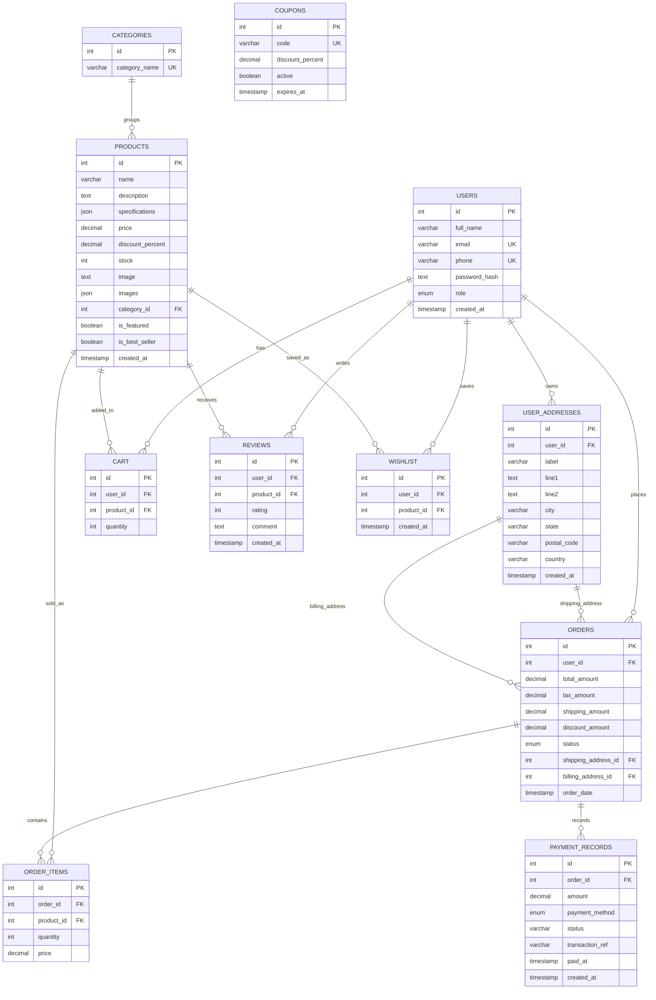

# ER Diagram

This diagram mirrors `backend/database/schema.sql`.

## Relationship Notes

- `users.email` and `users.phone` are unique.
- `products.category_id` references `categories.id`.
- `cart` enforces one cart row per user/product pair.
- `reviews` enforces one review per user/product pair.
- `wishlist` enforces one wishlist row per user/product pair.
- `orders.shipping_address_id` and `orders.billing_address_id` both reference `user_addresses.id`.
- `order_items` and `payment_records` cascade when an order is deleted.
- `coupons` are independent lookup records applied during checkout by `coupon_code`.
